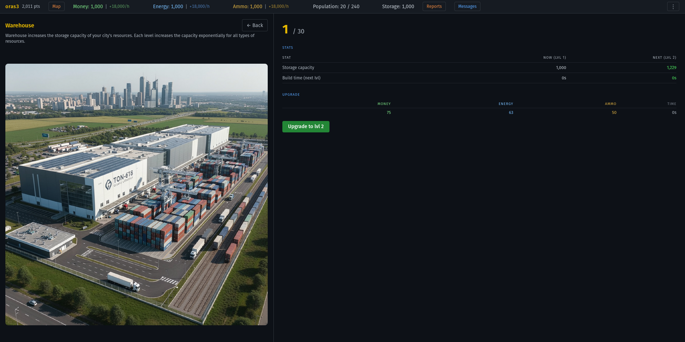

# aSignOfWar

A multiplayer real-time strategy game inspired by browser-based strategy games like Tribal Wars (RO: Triburile). Each player starts with a single city and develops it over time by constructing buildings, gathering resources, and training military units. Players form alliances and wage conquest wars against each other.

> **Note:** This README doubles as the project's reference documentation. It covers the full API surface, database schema, game mechanics, and architecture decisions so that contributors and self-hosters get a complete picture of the system without having to dig through the code. New to the project? See [CONTRIBUTING.md](CONTRIBUTING.md) to get set up.

## Table of contents

- [Features](#features)
- [Tech Stack](#tech-stack)
- [Setup](#setup)
- [Environment Variables](#environment-variables)
- [Admin Scripts](#admin-scripts)
- [Resetting the world](#resetting-the-world)
- [Playing with friends (ngrok)](#playing-with-friends-ngrok)
- [Project Structure](#project-structure)
- [API Endpoints](#api-endpoints)
- [Database Schema](#database-schema)
- [Game Mechanics](#game-mechanics)
  - [Buildings](#buildings)
  - [Resources](#resources)
  - [Units](#units)
  - [Commands](#commands)
  - [Battle Formula](#battle-formula)
  - [Spy Mechanic](#spy-mechanic)
  - [Siege and Conquest](#siege-and-conquest)
  - [Battle Simulator](#battle-simulator)
  - [Ghost Cities](#ghost-cities)
  - [Multiple Cities](#multiple-cities)
  - [Alliances](#alliances)
  - [Messages](#messages)
  - [Report Sharing](#report-sharing)
- [Job Queue (BullMQ)](#job-queue-bullmq)
- [Load Testing](#load-testing)
  - [Performance optimizations](#performance-optimizations)
- [Deployment](#deployment)
- [Development Approach](#development-approach)
- [Architecture Decisions](#architecture-decisions)
- [Contributing](#contributing)
- [License](#license)

## Features

- **Interactive city view** — isometric city image with clickable polygon hitboxes over each building slot, opening building details directly from the map
- **City management** — 9 building types, 3 resource economies, population system, upgrade queues
- **11 military units** across 6 categories (infantry, range, mechanized, siege, conquer, spy) with rock-paper-scissors defense mechanics
- **Real-time combat** — category-weighted battle formula shared between server and client-side battle simulator
- **Spy intelligence** — hacker-vs-hacker system separate from combat, with city snapshots on success
- **City conquest** — governor-based real-time siege (Grepolis-style): one successful conquest attack starts a 12h siege; defender breaks it by killing the besieger garrison before the timer runs out
- **Alliance system** — creation, invitations, applications, chat, member management, leaderboards
- **World map** — 300x300 grid with ghost NPC cities for early-game farming
- **Direct messages** with embedded shared battle/spy reports and quick-message button from player profiles
- **Alliance invite notifications** — incoming alliance invitations appear in the reports panel with accept/reject actions
- **Deployable** — Docker container (server) + Vercel static SPA (client)
- **Load tested** — 500 concurrent users at ~218 req/s with ~0.01% failure rate (Locust)

### Screenshots
These screenshots were taken with GAME_SPEED=600 (see server/.env) for testing purposes, which is why the construction and recruitment times are so short. Normally, at speed 1, for example, constructions take hours, and recruitment—depending on the quantity—can take days.

| City dashboard | World map |
|:-:|:-:|
|  |  |

| Headquarters | Military base |
|:-:|:-:|
|  |  |

| Unit info | Air defense |
|:-:|:-:|
|  |  |

| Power plant | Weapons factory |
|:-:|:-:|
|  |  |

| Harbor | Warehouse |
|:-:|:-:|
|  |  |

## Tech Stack

**Frontend:** React 18 + TypeScript + Vite + Tailwind CSS 4 + TanStack Query 5 + React Router 6

**Backend:** Node.js + Express 5 + TypeScript + Prisma 5 (PostgreSQL) + BullMQ (Redis) + Zod 4

**Auth:** JWT (jsonwebtoken) + bcrypt

**File uploads:** Multer (player/alliance avatars, stored in `server/uploads/`)

## Setup

**Prerequisites:** [Docker Desktop](https://www.docker.com/products/docker-desktop/) (or Docker Engine + docker-compose-v2)

1. Clone the repo and configure environment variables:

```bash
git clone https://github.com/lauppv/aSignOfWar
cd aSignOfWar
cp server/.env.example server/.env
```

Edit `server/.env` and set real values for `DATABASE_PASSWORD` and `JWT_SECRET` (everything else can stay as-is).

2. Build and start all services:

```bash
docker compose --env-file server/.env up --build
```

Open **http://localhost:3000** — the full app is served there (API + client SPA).

Subsequent starts (no code changes) skip the `--build` flag:

```bash
docker compose --env-file server/.env up
```

**Useful commands:**

```bash
# Stop all services (data is preserved in Docker volumes)
docker compose down

# Stop and delete all data (clean slate)
docker compose down -v

# Follow logs
docker compose logs -f app
```

> **How it works:** The `Dockerfile` builds both the Vite client and the Express server into a single image. The server serves the compiled SPA as static files alongside the API, so only one container and one port (`3000`) are needed. PostgreSQL and Redis run as sibling containers on an internal Docker network. On startup the container automatically runs `prisma migrate deploy` before booting the server.

<details>
<summary><strong>Alternative: Local setup (without Docker)</strong></summary>

### Prerequisites

- [Node.js](https://nodejs.org/) (v18+)
- [PostgreSQL](https://www.postgresql.org/) (v14+)
- [Redis](https://redis.io/) (v6+)

**Ubuntu/Debian:**

```bash
curl -fsSL https://deb.nodesource.com/setup_20.x | sudo -E bash -
sudo apt install -y nodejs postgresql postgresql-contrib redis-server
sudo systemctl start postgresql redis-server
```

**macOS (Homebrew):**

```bash
brew install node postgresql@14 redis
brew services start postgresql@14
brew services start redis
```

**Windows:** Install Node.js from the official site, PostgreSQL from the installer at postgresql.org, and Redis via WSL2 or Memurai.

### Database setup

```bash
sudo -u postgres psql
```

```sql
CREATE USER asow WITH PASSWORD 'your_password';
CREATE DATABASE asow OWNER asow;
\q
```

### Running

```bash
cd server && npm install && npm run db:migrate && cd ..
cd client && npm install && cd ..
```

Start in two terminals:

```bash
# Terminal 1 — server
cd server && npm run dev

# Terminal 2 — client
cd client && npm run dev
```

Client runs on `http://localhost:5173`. Server runs on `http://localhost:3000`.

</details>

## Environment Variables

| Variable | Description | Required | Default |
|----------|-------------|----------|---------|
| `PORT` | Server port | No | `3000` |
| `DATABASE_HOST` | PostgreSQL host | Yes | — |
| `DATABASE_PORT` | PostgreSQL port | No | `5432` |
| `DATABASE_NAME` | Database name | Yes | — |
| `DATABASE_USER` | Database user | Yes | — |
| `DATABASE_PASSWORD` | Database password | Yes | — |
| `JWT_SECRET` | Secret for signing JWT tokens | Yes | — |
| `REDIS_URL` | Redis connection string | Yes | — |
| `NODE_ENV` | `development` or `production` | No | `development` |
| `GAME_SPEED` | Game speed multiplier (1 = normal, higher = faster) | No | `1` |
| `SIEGE_DURATION_MINUTES` | How long a siege lasts before conquest completes (absolute minutes — does **not** scale with `GAME_SPEED`) | No | `720` (12h) |
| `CLIENT_URL` | Frontend URL (production CORS origin) | Production only | — |

## Admin Scripts

Run admin scripts inside the running `app` container via `docker compose exec`:

```bash
docker compose exec app npx tsx scripts/dev-cheats.ts <command> [args]      # Dev cheats (refill resources, set units, etc.)
docker compose exec app npx tsx scripts/reset-and-seed-test-world.ts        # Wipe the world and seed 5 maxed-out players (player1..player5 / asdasd) with alliances
docker compose exec app npx tsx scripts/seed-ghosts.ts                      # Seed ghost cities around existing players
docker compose exec app npx tsx scripts/repack-map.ts                       # Re-arrange all cities in a spiral layout
docker compose exec app npx tsx scripts/backfill-ghost-buildings.ts         # Backfill buildings for legacy ghost cities
docker compose exec app npx tsx scripts/resolve-stuck-commands.ts           # Re-queue stuck TRAVELING commands
```

## Resetting the world

To wipe all data and start fresh (like a new world in Tribal Wars):

```bash
docker compose down -v                              # Deletes all Docker volumes (Postgres data + Redis)
docker compose --env-file server/.env up --build     # Rebuild and start fresh
```

## Playing with friends (ngrok)

You can host the game locally and let friends on different networks join via [ngrok](https://ngrok.com/). Docker serves the full app on port 3000, so only one tunnel is needed.

1. Start the app:

```bash
docker compose --env-file server/.env up --build
```

2. Start ngrok (in a separate terminal):

```bash
ngrok http 3000
```

3. Share the ngrok URL (e.g. `https://abc123.ngrok-free.app`) with your friends. They open it in a browser and register/play normally.

The ngrok URL is random and unlisted — only people you share it with can access the game. For extra security, ngrok supports basic auth (`ngrok http 3000 --basic-auth="user:password"`) or IP restrictions on paid plans.

## Project Structure

```
aSignOfWar/
├── shared/                            # Shared code (imported by both client and server)
│   ├── gameConfig.ts                  # Single source of truth: buildings, units, costs, speeds
│   └── battleCalc.ts                  # Battle formula (used server-side + client simulator)
│
├── server/
│   ├── test.rest                       # API-first testing file (VS Code REST Client)
│   ├── prisma/
│   │   └── schema.prisma              # Database schema (15 models, 6 enums)
│   ├── scripts/                       # One-off admin/maintenance scripts
│   │   ├── dev-cheats.ts              # Dev CLI: refill, setUnits, setBuilding, maxAll, etc.
│   │   ├── seed-ghosts.ts             # Seed ghost cities around players
│   │   ├── repack-map.ts             # Re-arrange city positions on the map
│   │   ├── backfill-ghost-buildings.ts # Backfill buildings for legacy ghosts
│   │   └── resolve-stuck-commands.ts  # Re-queue stuck commands
│   ├── src/
│   │   ├── app.ts                     # Express entry point, route mounting, worker boot
│   │   ├── config/
│   │   │   ├── db.ts                  # Prisma client singleton
│   │   │   ├── env.ts                 # Environment variable loader + validation
│   │   │   ├── redis.ts               # IORedis connection
│   │   │   └── queue.ts              # BullMQ queue definitions
│   │   ├── middleware/
│   │   │   ├── auth.ts                # JWT verification, attaches userId to request
│   │   │   └── validate.ts            # Zod schema validation middleware
│   │   ├── api/
│   │   │   ├── schemas.ts             # Zod schemas for all request bodies
│   │   │   ├── controllers/           # Request handlers (13 controllers)
│   │   │   │   ├── auth.controller.ts
│   │   │   │   ├── building.controller.ts
│   │   │   │   ├── city.controller.ts
│   │   │   │   ├── command.controller.ts
│   │   │   │   ├── governor.controller.ts
│   │   │   │   ├── map.controller.ts
│   │   │   │   ├── ranking.controller.ts
│   │   │   │   ├── recruitment.controller.ts
│   │   │   │   ├── report.controller.ts
│   │   │   │   ├── siege.controller.ts
│   │   │   │   ├── sharedReport.controller.ts
│   │   │   │   ├── alliance.controller.ts
│   │   │   │   ├── message.controller.ts
│   │   │   │   └── user.controller.ts
│   │   │   └── routes/                # Route definitions (13 route files)
│   │   │       ├── auth.routes.ts
│   │   │       ├── building.routes.ts
│   │   │       ├── city.routes.ts
│   │   │       ├── command.routes.ts
│   │   │       ├── config.routes.ts
│   │   │       ├── governor.routes.ts
│   │   │       ├── map.routes.ts
│   │   │       ├── ranking.routes.ts
│   │   │       ├── recruitment.routes.ts
│   │   │       ├── report.routes.ts
│   │   │       ├── siege.routes.ts
│   │   │       ├── alliance.routes.ts
│   │   │       ├── message.routes.ts
│   │   │       └── user.routes.ts
│   │   ├── services/                  # Business logic (16 services)
│   │   │   ├── auth.service.ts        # Register, login, password hashing
│   │   │   ├── building.service.ts    # Building upgrades, cancel, queue scheduling
│   │   │   ├── city.service.ts        # City overview, resource sync, rename
│   │   │   ├── recruitment.service.ts # Unit recruitment, cancel, queue scheduling
│   │   │   ├── command.service.ts     # Send/cancel commands, travel time calculation
│   │   │   ├── battle.service.ts      # Battle resolution, loot, loyalty, conquest
│   │   │   ├── governor.service.ts    # Governor deposit/recruit (account-wide)
│   │   │   ├── map.service.ts         # World map, city placement, ghost city spawning
│   │   │   ├── slotAllocator.ts      # In-memory slot allocator with async mutex
│   │   │   ├── ghost.service.ts       # Ghost city auto-upgrade ticker
│   │   │   ├── ranking.service.ts     # Player and alliance leaderboards
│   │   │   ├── report.service.ts      # Battle/spy/support/resource report queries
│   │   │   ├── siege.service.ts       # Siege lifecycle, conquest, auto-battle, shared siege
│   │   │   ├── sharedReport.service.ts # Report sharing with visibility options
│   │   │   ├── alliance.service.ts    # Alliance CRUD, invites, applications, chat
│   │   │   ├── message.service.ts     # Direct messages between players
│   │   │   ├── user.service.ts        # Player profiles, description, search
│   │   │   └── avatar.service.ts      # Avatar upload (player + alliance)
│   │   └── workers/                   # BullMQ job processors
│   │       ├── building.worker.ts     # Completes building upgrades
│   │       ├── recruitment.worker.ts  # Completes unit recruitment
│   │       ├── command.worker.ts      # Processes command arrivals and returns
│   │       └── siege.worker.ts        # Siege timer expiry → conquest completion
│   └── uploads/                       # Avatar file storage (gitignored)
│
├── client/
│   ├── index.html
│   ├── vite.config.ts
│   └── src/
│       ├── main.tsx                   # React entry point
│       ├── App.tsx                    # Router, context providers, route definitions
│       ├── index.css                  # Tailwind imports
│       ├── types/
│       │   └── index.ts              # Shared TypeScript types (API responses, game entities)
│       ├── api/                       # API client functions (fetch wrappers)
│       │   ├── client.ts             # Base fetch wrapper, auth token, error handling
│       │   ├── auth.ts               # Login, register
│       │   ├── city.ts               # City data, rename
│       │   ├── command.ts            # Send/cancel/list commands
│       │   ├── map.ts                # World map data
│       │   ├── report.ts            # Reports CRUD + sharing
│       │   ├── siege.ts             # Siege status, share siege, shared siege view
│       │   ├── ranking.ts           # Leaderboard queries
│       │   ├── governor.ts          # Governor deposit/recruit
│       │   ├── alliance.ts          # Alliance CRUD, invites, applications, chat
│       │   ├── message.ts           # Direct messages
│       │   └── user.ts              # Player profiles, avatar upload
│       ├── context/                   # React context providers
│       │   ├── TickContext.tsx        # Real-time clock (1s tick) for countdowns
│       │   ├── UnitInfoContext.tsx    # Unit info modal (click any unit icon)
│       │   ├── PlayerProfileContext.tsx   # Player profile modal
│       │   └── AllianceProfileContext.tsx # Alliance profile modal
│       ├── hooks/
│       │   └── useClickOutside.ts    # Click-outside + Escape key hook
│       ├── lib/                       # Shared utilities
│       │   ├── labels.ts            # Display names, colors, unit/building order
│       │   ├── cityHelpers.ts       # Helper functions for city data
│       │   └── gameSpeed.ts         # Loads game speed from server config
│       ├── pages/                     # Route-level page components
│       │   ├── LoginPage.tsx
│       │   ├── RegisterPage.tsx
│       │   ├── CityPage.tsx          # Main city dashboard (buildings, units, commands)
│       │   ├── MapPage.tsx           # World map (scrollable grid, city selection)
│       │   ├── RankingsPage.tsx      # Player and alliance leaderboards
│       │   ├── AlliancePage.tsx      # Alliance management (members, chat, settings)
│       │   └── MessagesPage.tsx      # Direct messages between players
│       └── components/                # Reusable UI components
│           ├── Layout.tsx            # Authenticated layout (nav bar, resource bar)
│           ├── ResourceBar.tsx       # Live resource totals + production rates + city switcher
│           ├── CityMap.tsx           # Isometric city canvas (building slots)
│           ├── BuildingsView.tsx     # Building list
│           ├── BuildingDetailView.tsx # Building upgrade panel
│           ├── MilitaryBaseView.tsx  # Unit recruitment UI
│           ├── UnitCard.tsx          # Single unit display card
│           ├── UnitInfoModal.tsx     # Unit stats popup
│           ├── CityActionPanel.tsx   # Map command composer (attack/support/resources/spy)
│           ├── CommandDetailModal.tsx # Command inspection modal
│           ├── CancelCommandConfirm.tsx # Command cancel confirmation
│           ├── ReportsView.tsx       # Battle/spy/support/resource/conquest reports
│           ├── SiegeBadge.tsx        # Small siege indicator badge
│           ├── SiegeCard.tsx         # Full siege overlay (timer, defending force, incoming)
│           ├── UnitIcon.tsx          # Reusable unit image + quantity badge
│           ├── SimulatorView.tsx     # Offline battle calculator
│           ├── PlayerProfileModal.tsx # Player profile (stats, cities, avatar)
│           ├── AllianceProfileModal.tsx # Alliance profile
│           ├── MessageContent.tsx    # Message rendering (shared reports, rich text)
│           └── ConfirmModal.tsx      # Generic confirmation dialog
├── Dockerfile                         # Multi-stage Docker build for the server (Alpine + Prisma)
├── vercel.json                        # Vercel config for client SPA deployment
├── screenshots/                       # README screenshots (city, map, buildings, units)
├── plan.txt                           # Game design document (Romanian)
├── simulations.txt                    # Tribal Wars battle simulations used as reference for balancing
└── locustfile.py                      # Load test (Locust) — simulates concurrent players
```

## API Endpoints

Authentication uses Bearer tokens: `Authorization: Bearer <token>`

### Auth

| Method | Endpoint | Auth | Description |
|--------|----------|------|-------------|
| POST | `/api/auth/register` | No | Register user + create starter city + spawn ghost cities nearby |
| POST | `/api/auth/login` | No | Login, returns JWT token |

### Cities

| Method | Endpoint | Auth | Description |
|--------|----------|------|-------------|
| GET | `/api/cities/mine?cityId=...` | Yes | City overview (buildings, units, resources, orders). Defaults to oldest owned city. Response includes `ownedCities[]` |
| PATCH | `/api/cities/mine/name` | Yes | Rename a city (`{ name, cityId? }`) |
| GET | `/api/cities/:cityId/siege-status` | Yes | Active siege state for a city: timer, attacker/defender, defending force, incoming commands. Visible to the city owner, the besieger, and members of either side's alliance. |

### Buildings

| Method | Endpoint | Auth | Description |
|--------|----------|------|-------------|
| POST | `/api/buildings/:buildingId/upgrade` | Yes | Start building upgrade (queued via BullMQ) |
| DELETE | `/api/buildings/orders/:orderId` | Yes | Cancel a pending upgrade order (75% refund) |

### Recruitment

| Method | Endpoint | Auth | Description |
|--------|----------|------|-------------|
| POST | `/api/cities/:cityId/recruit` | Yes | Start unit recruitment |
| DELETE | `/api/recruitment/orders/:orderId` | Yes | Cancel a pending recruitment order (75% refund) |

### Governor

| Method | Endpoint | Auth | Description |
|--------|----------|------|-------------|
| GET | `/api/governor` | Yes | Governor progress: produced count, current deposits, next cost |
| POST | `/api/governor/deposit` | Yes | Deposit resources into shared governor progress bars from any city |
| POST | `/api/governor/recruit` | Yes | Finalize recruitment once all three bars are full |

### Commands

| Method | Endpoint | Auth | Description |
|--------|----------|------|-------------|
| POST | `/api/cities/:cityId/commands` | Yes | Send attack / support / resources / spy command |
| GET | `/api/cities/:cityId/commands` | Yes | List outgoing and incoming commands |
| POST | `/api/cities/:cityId/commands/:commandId/cancel` | Yes | Cancel a TRAVELING command (5-minute window) |
| POST | `/api/cities/:cityId/commands/withdraw` | Yes | Withdraw stationed SUPPORT units home |

### Sieges

| Method | Endpoint | Auth | Description |
|--------|----------|------|-------------|
| POST | `/api/sieges/:siegeId/share` | Yes | Create a shareable link to an active siege |
| GET | `/api/sieges/shared/:id` | Yes | View a shared siege (live status if still active) |

### Map

| Method | Endpoint | Auth | Description |
|--------|----------|------|-------------|
| GET | `/api/map` | Yes | World map: grid size + all cities (coords, owner, alliance) |

### Reports

| Method | Endpoint | Auth | Description |
|--------|----------|------|-------------|
| GET | `/api/reports` | Yes | List all reports for the user |
| DELETE | `/api/reports` | Yes | Hide all reports |
| DELETE | `/api/reports/:id` | Yes | Hide a single report |
| POST | `/api/reports/:commandId/share` | Yes | Create a shared report link (with visibility options) |
| GET | `/api/reports/shared/:id` | Yes | View a shared report |

### Rankings

| Method | Endpoint | Auth | Description |
|--------|----------|------|-------------|
| GET | `/api/rankings` | Yes | Player leaderboard (points, kills, loot) |
| GET | `/api/rankings/alliances` | Yes | Alliance leaderboard |

### Alliances

| Method | Endpoint | Auth | Description |
|--------|----------|------|-------------|
| GET | `/api/alliances` | Yes | List all alliances |
| POST | `/api/alliances` | Yes | Create an alliance |
| PATCH | `/api/alliances` | Yes | Update alliance settings (name, tag, access mode) |
| GET | `/api/alliances/me` | Yes | Get own alliance details |
| POST | `/api/alliances/leave` | Yes | Leave current alliance |
| POST | `/api/alliances/disband` | Yes | Disband alliance (leader only) |
| POST | `/api/alliances/invite` | Yes | Invite player by username |
| GET | `/api/alliances/invitations` | Yes | List alliance's pending invitations (leader) |
| DELETE | `/api/alliances/invitations/:id` | Yes | Cancel an invitation |
| POST | `/api/alliances/invitations/:id/accept` | Yes | Accept an invitation |
| POST | `/api/alliances/invitations/:id/reject` | Yes | Reject an invitation |
| GET | `/api/alliances/me/invitations` | Yes | List invitations received by the user |
| GET | `/api/alliances/me/application` | Yes | Get own pending application |
| POST | `/api/alliances/me/application/cancel` | Yes | Cancel own application |
| GET | `/api/alliances/applications` | Yes | List applications to your alliance (leader) |
| POST | `/api/alliances/applications/:id/accept` | Yes | Accept an application |
| POST | `/api/alliances/applications/:id/reject` | Yes | Reject an application |
| POST | `/api/alliances/members/:id/kick` | Yes | Kick a member (leader only) |
| POST | `/api/alliances/members/:id/transfer` | Yes | Transfer leadership |
| GET | `/api/alliances/messages/unread` | Yes | Check for unread alliance messages |
| GET | `/api/alliances/messages` | Yes | List alliance chat messages |
| POST | `/api/alliances/messages` | Yes | Post alliance chat message |
| DELETE | `/api/alliances/messages/:id` | Yes | Delete an alliance message (leader) |
| POST | `/api/alliances/:id/avatar` | Yes | Upload alliance avatar |
| GET | `/api/alliances/:id/profile` | Yes | Get alliance profile (public) |
| GET | `/api/alliances/:id` | Yes | Get alliance details |
| POST | `/api/alliances/:id/join` | Yes | Join an open alliance |
| POST | `/api/alliances/:id/apply` | Yes | Submit application to an alliance |

### Messages

| Method | Endpoint | Auth | Description |
|--------|----------|------|-------------|
| GET | `/api/messages/direct/unread` | Yes | Count unread direct messages |
| GET | `/api/messages/direct/conversations` | Yes | List conversation threads |
| GET | `/api/messages/direct/:peerId` | Yes | List messages with a specific player |
| POST | `/api/messages/direct` | Yes | Send a direct message |
| DELETE | `/api/messages/direct/:id` | Yes | Delete a message (soft-delete per side) |

### Users

| Method | Endpoint | Auth | Description |
|--------|----------|------|-------------|
| PATCH | `/api/users/me/description` | Yes | Update own profile description |
| POST | `/api/users/me/avatar` | Yes | Upload player avatar |
| GET | `/api/users/:id/profile` | Yes | Get player profile (cities, stats, alliance) |

### Config

| Method | Endpoint | Auth | Description |
|--------|----------|------|-------------|
| GET | `/api/config` | No | Returns shared game config (buildings, units, speed, travel constants) |

## Database Schema

16 models across 7 enums. Key entities:

- **User** — player account, governor progress, lifetime combat stats, alliance membership
- **City** — coordinates, resources (lazily synced), owner (nullable for ghost cities)
- **Siege** — active or historical siege on a city: attacker, garrison command, expiry timestamp, status (`ACTIVE`, `BROKEN_BY_DEFENSE`, `BROKEN_BY_NEW_SIEGE`, `COMPLETED_CONQUEST`)
- **Building** — 9 types per city, level 0–30
- **Unit** — 11 types per city, quantity tracked
- **Command** — attack/support/resources/spy with travel state machine (TRAVELING → ARRIVED/RETURNING → COMPLETED)
- **CommandUnit** — units attached to a command
- **BuildingUpgradeOrder** / **RecruitmentOrder** — queued orders with BullMQ job references
- **Alliance** — name, tag, access mode (OPEN/CLOSED/INVITE_ONLY/APPLICATION), leader
- **AllianceInvitation** / **AllianceApplication** — join request management
- **AllianceMessage** — alliance chat (soft-deletable)
- **DirectMessage** — player-to-player messages (read tracking, soft-delete per side)
- **SharedReport** — shared battle/spy reports with visibility toggles

## Game Mechanics

### Buildings

9 building types, upgradeable to level 20–30. Each level increases cost and construction time exponentially. Headquarters level reduces construction time by 2% per level.

| Building | Function | Max Level | HQ Required |
|----------|----------|-----------|-------------|
| Headquarters | Reduces construction time 2%/level | 30 | — |
| Bank | Produces Money | 30 | — |
| Power plant | Produces Energy | 30 | — |
| Weapons factory | Produces Ammo | 30 | — |
| Housing | Population limit (240–24,000) | 30 | — |
| Warehouse | Resource storage limit (1,000–400,000) | 30 | — |
| Military base | Unlocks units, speeds up recruitment | 25 | HQ 5 |
| Harbor | Send resources to other cities | 25 | HQ 15 |
| Air defense | Passive city defense bonus | 20 | HQ 5 |

### Resources

- **Money** — produced by Bank
- **Energy** — produced by Power plant
- **Ammo** — produced by Weapons factory

Production rates increase per building level. Resources are synced lazily before any operation that reads or modifies them (no background worker needed).

### Units

11 unit types across 6 categories. Most are recruited from Military base; Governor is recruited via a special account-wide deposit mechanic, and Hacker is recruited from Headquarters.

| Unit | Category | Attack | Defense (I/R/M) | Speed | Pop | HQ | MB |
|------|----------|--------|-----------------|-------|-----|----|----|
| Light infantry | Infantry | 10 | 15/25/10 | 8 | 1 | — | — |
| Defender infantry | Infantry | 5 | 30/30/30 | 12 | 1 | 5 | — |
| Heavy infantry | Infantry | 40 | 20/10/20 | 12 | 2 | — | — |
| Sniper | Range | 60 | 10/30/10 | 10 | 3 | 10 | 10 |
| Special forces | Range | 80 | 40/40/40 | 6 | 4 | 15 | 10 |
| Raider | Mechanized | 30 | 10/10/20 | 4 | 3 | 10 | — |
| Tank | Mechanized | 100 | 50/20/50 | 14 | 6 | 20 | 15 |
| Missile launcher | Siege | 40 | 5/5/5 | 16 | 5 | 20 | 15 |
| Drone | Siege | 50 | 5/5/5 | 18 | 6 | 20 | 20 |
| Governor | Conquer | 0 | 10/10/10 | 16 | 0 | 30 | — |
| Hacker | Spy | 0 | 0/0/0 | 6 | 1 | 10 | — |

*Speed = minutes per map field. Lower = faster. I/R/M = defense vs Infantry/Range/Mechanized.*

### Commands

Players send four types of commands between cities:

| Type | Description |
|------|-------------|
| Attack | Send units to attack another city. Surviving units return with loot |
| Support | Send units to reinforce a city. They stay and defend until withdrawn |
| Resources | Send resources via Harbor merchants |
| Spy | Send hackers to gather intel on a target city |

**Travel time** is computed from euclidean distance and the slowest unit in the stack:

```
distance  = sqrt((x2 - x1)^2 + (y2 - y1)^2)
travel_s  = distance * slowestSpeed * 60 / GAME_SPEED
```

Resource transports use a fixed speed of 2 minutes per field. A TRAVELING command can be cancelled within the first 5 minutes — units return home symmetrically.

### Battle Formula

The combat model is inspired by Tribal Wars but adapted around three attack categories — **Infantry**, **Range**, and **Mechanized** — plus a separate **Air Defense** subsystem. The same `calculateBattle()` function in `shared/battleCalc.ts` runs both on the server (for real combat) and in the client-side simulator, so the two can never drift.

#### Step-by-step resolution

A battle is resolved in a fixed order. Each step's output feeds the next.

**1. Filter out non-combat units.** Hackers (SPY category) are removed from both sides — they have a dedicated spy-vs-spy system and never participate in regular combat.

**2. Compute attacker force per category.** Each unit's `attack` stat is summed into its category bucket:

```
A.INFANTRY   = sum(unit.attack * quantity) for INFANTRY units
A.RANGE      = sum(unit.attack * quantity) for RANGE units
A.MECHANIZED = sum(unit.attack * quantity) for MECHANIZED units
A_total      = A.INFANTRY + A.RANGE + A.MECHANIZED
```

**3. Compute defender force, with separate stats per attack type.** Every defender unit has three defense values: `defenseVsInfantry`, `defenseVsRange`, `defenseVsMechanized`. Air defense applies a flat bonus (4%–107% based on level) on top:

```
mult = 1 + (airDefenseBonus / 100)
D_orig.INFANTRY   = sum(unit.defenseVsInfantry   * quantity * mult)
D_orig.RANGE      = sum(unit.defenseVsRange      * quantity * mult)
D_orig.MECHANIZED = sum(unit.defenseVsMechanized * quantity * mult)
```

**4. Weight the defense by attacker composition.** This is the key design decision — it rewards balanced armies and punishes one-dimensional ones:

```
D_eff_orig = (A.INFANTRY   / A_total) * D_orig.INFANTRY
           + (A.RANGE      / A_total) * D_orig.RANGE
           + (A.MECHANIZED / A_total) * D_orig.MECHANIZED
```

If the attacker sends 100% mechanized units, only `defenseVsMechanized` matters — sending tanks against a wall of anti-tank guns is a bad trade. A balanced 33/33/33 split forces the defender to be balanced too.

**5. Compute the battle ratio.** This is `A_total / D_eff_orig`, capped at 1. It scales how effective siege units are — lose hard, you still get *some* siege damage proportional to how close you came:

```
battleRatio = min(1, A_total / D_eff_orig)
```

**6. Resolve siege (pre-battle).** Missile launchers destroy air defense levels; drones either help against air defense (no target selected) or demolish a chosen building. When sending an attack with drones, the attacker can select a **target building** from a dropdown — if set, drones focus on demolishing that building instead of contributing to air defense damage. Effective siege count is scaled by `battleRatio`:

```
effectiveML            = floor(missileLaunchers * battleRatio)
effectiveDronesAD      = floor(drones * battleRatio)   // only if target is AIR_DEFENSE or unset
airDefLevelsDestroyed  = calcAirDefenseDamage(level, effectiveML, effectiveDronesAD)
newAirDefenseLevel     = airDefenseLevel - airDefLevelsDestroyed

// Drone building demolition (post-battle, with initial drone count):
buildingLevelsDestroyed = calcBuildingDamage(buildingLevel, initialDrones, battleRatio)
```

The reduced air defense applies *retroactively* to the main battle — if you destroy 2 levels of AD, the surviving defenders fight at the lower bonus. The battle report shows both air defense damage and drone target building damage side by side.

**7. Recompute defender force with the reduced air defense**, then determine the winner:

```
attackerWon = A_total > 0 && A_total >= D_eff
```

A zero-attack force (e.g. a Governor sent alone) can never win — `A_total = 0` means `attackerWon = false` regardless of the defense. This blocks the exploit of sending a Governor to an empty city without an escort.

**8. Apply losses.**

If the attacker wins, losses are computed *per category* using a power curve — bigger overkill = lower losses, but never zero:

```
atkLoss[cat] = (D[cat] / A_total) ^ 1.5     for each category with units
```

**Governor protection:** Governors are excluded from loss calculation. If the attacker wins and at least one combat unit survives, all Governors survive intact. If no combat units survive, Governors die too — they can't hold a city alone.

If the attacker loses, all attacker units die (`atkLoss = 1.0` across the board).

Defender loss rate is the inverse, also a power curve:

```
defLossRate = 1.0                              if attacker won
defLossRate = (A_total / D_eff) ^ 1.5          if attacker lost
```

The exponent of 1.5 is the same Tribal Wars curve — it makes overwhelming victories cheap, narrow victories expensive, and total defeats brutal.

**9. Loot (only if attacker won).** Total carry capacity from *surviving* attackers is split equally across the three resources to prevent cherry-picking:

```
totalCarry  = sum(unit.carry * survivors)
perResource = floor(totalCarry / 3)
stolen[r]   = min(defender[r], perResource)   for r in (money, energy, ammo)
```

**10. Conquest trigger (siege start).** If the attacker wins and at least one surviving Governor accompanied the attack, the surviving force becomes a stationed garrison in the target city (a `SUPPORT`/`ARRIVED` command) and a `Siege` row is created with a fixed-duration timer. Ownership doesn't transfer here — that happens later, in `siege.worker`, only if the defender fails to kill the garrison before the timer expires. See [Siege and Conquest](#siege-and-conquest) for the full flow.

#### Worked example

Attacker sends 100 Soldiers (INFANTRY, attack 10) + 100 Tanks (MECHANIZED, attack 30). Defender has 200 Soldiers (defVsInf 8, defVsMech 4), air defense level 0.

```
A.INFANTRY   = 100 * 10 = 1000
A.MECHANIZED = 100 * 30 = 3000
A_total      = 4000

D.INFANTRY   = 200 * 8 = 1600
D.MECHANIZED = 200 * 4 = 800

D_eff = (1000/4000)*1600 + (3000/4000)*800
      = 0.25*1600 + 0.75*800
      = 400 + 600
      = 1000

attackerWon = 4000 >= 1000 → true

atkLoss[INF]  = (1600/4000)^1.5 ≈ 0.253  → 25 of 100 soldiers die
atkLoss[MECH] = ( 800/4000)^1.5 ≈ 0.089  → 9 of 100 tanks die
```

The attacker wins decisively but still loses more infantry than mechanized — because the defender is better at killing soldiers than tanks, and the attack-weighted formula reflects that.

#### Why these choices

- **Category-weighted defense** means there is no "best unit" — every army composition has a counter.
- **Pre-battle siege scaled by battle ratio** avoids all-or-nothing siege: you can soften a fortress over multiple losing waves.
- **Air defense applied as a multiplicative bonus on all units** means a single AD upgrade boosts every defender, making AD a high-leverage building.
- **Hackers excluded** keeps espionage and combat as separate strategic dimensions.
- **Conquest is a siege, not a loyalty drain** — one decisive break-through kicks off a 12h timer, not a 4-attack stat grind. See [Siege and Conquest](#siege-and-conquest).

### Spy Mechanic

Only Hacker units participate. This is a separate system from regular combat — hackers cannot be sent in attack or support commands, and hackers cannot be included in attack or support commands. Attacker sends N hackers; defender has D hackers (native + stationed support).

- If `N > D`: spy succeeds. Attacker gets a full snapshot of the target city (buildings, units, resources). All N attacker hackers are consumed. Defender hackers are untouched. The defender is **not notified** — they receive no report.
- If `N <= D`: spy fails. All N attacker hackers are consumed, no intel is retrieved. The defender loses N hackers (distributed proportionally across native and stationed support stacks). The defender receives a report about the failed spy attempt.

The attacker always loses all sent hackers regardless of outcome — espionage is a one-way expenditure. On failure, both sides take equal losses (N hackers each). Kill stats are tracked: the defender gets kill credit for the attacker's hackers, and on failure, the attacker gets kill credit for the defender's losses.

### Siege and Conquest

Conquest works like Grepolis, not the original Tribal Wars: a single conquest attack that breaks through starts a real-time siege, and the defender has a fixed window to break it before ownership transfers.

#### Starting a siege

When an attack with at least one **Governor** in the stack lands and at least one attacker unit survives the battle, the surviving force becomes a **garrison** stationed in the target city (modeled as a `SUPPORT`/`ARRIVED` command from the attacker), and a `Siege` row is created with `status = ACTIVE` and `endsAt = now + SIEGE_DURATION_MINUTES`. A BullMQ timer is scheduled at `endsAt`.

Only one siege can be active per city. If a second conquest attack from a different player breaks through while a siege is already active, the old garrison is killed in the battle calculation, the previous `Siege` row is marked `BROKEN_BY_NEW_SIEGE`, its timer is cancelled, and a fresh `ACTIVE` siege is created with a brand-new 12h timer (chained sieges always reset).

#### Breaking a siege

The defender (or anyone — alliance members, third parties) can break the siege by killing the besieger garrison before the timer expires. Any incoming `ATTACK` against the besieged city goes through the normal battle resolution: the besieger garrison sits in the defending stack alongside the city's own units, and benefits from the city's `Air Defense` bonus (so it's strategically meaningful to keep AD high on key cities, or low on cities you might need to retake from a besieger). When the garrison drops to zero units, the siege is marked `BROKEN_BY_DEFENSE` and ownership stays with the original owner.

#### Auto-engagement on a besieged city

Two extra rules close the loops that the city owner can't act on (since the city is locked):

- **Returning units** (raiders coming home, withdrawn supports arriving back) sent from the besieged city before the siege started: on arrival they automatically attack the besieger garrison instead of joining the city's units.
- **Incoming supports** from allies sent to the besieged city: they also auto-attack the garrison instead of stationing peacefully. Survivors stay as `SUPPORT`/`ARRIVED` (and contribute to defense for any future attack).

Both use the same `resolveAttackOnBesiegedCity` helper (`server/src/services/siege.service.ts`) and run the standard battle calc against besieger garrison + city units, with the city's Air Defense applied.

#### What's locked, what isn't

While a siege is active, the city owner cannot:
- send any command from the besieged city (`CITY_UNDER_SIEGE`)
- start a new building upgrade or recruitment from the besieged city
- the besieger cannot withdraw the garrison (`CANNOT_WITHDRAW_BESIEGER_GARRISON`)

Resource production, scheduled building upgrades, and recruitment orders **continue to run normally** — that's intentional. Newly recruited units land in the city's `Unit` table and from that point on count as defenders, which means they help the besieger defend the garrison against counter-attacks. The defender's responsibility is to cancel recruitment queues *before* the city falls under siege; once besieged, those units effectively reinforce the enemy.

#### Siege timer expiry (conquest completion)

If the timer fires and the siege is still `ACTIVE`, `completeConquest` (siege.service):
1. consumes one Governor from the garrison;
2. transfers `City.ownerId` to the attacker;
3. resets all native units in the city to 0;
4. cancels pending build/recruit orders (no refund — it's war);
5. cancels outgoing `RESOURCES` commands from the besieged city (they evaporate);
6. displaces third-party supports stationed in the city back home;
7. marks the siege `COMPLETED_CONQUEST`.

The garrison command stays — it becomes the new owner's own stationed support in their newly-conquered city, withdrawable normally.

#### Real-time siege card

While a city is besieged, both the attacker and defender (and their alliance members) see the same `SiegeCard` modal: timer, total defending force, and a list of incoming attacks/supports with ETA. Polling at 5s while the card is mounted (`GET /api/cities/:cityId/siege-status`). The composition of `ATTACK`/`SPY` commands is hidden from the defender (only direction + ETA visible); `SUPPORT`/`RESOURCES` show the units/resources being sent.

#### Why this design

- **Single attack starts a siege** instead of multi-attack loyalty drain → conquest commitment is one decisive battle, not a war of attrition.
- **Time-bound conquest with a counter-window** turns sieges into a coordination test for the defender's alliance, not a stat check.
- **Recruited units defending the besieger** is a brutal-but-consistent rule: "no control over the city" cuts both ways, and it adds a real skill check (cancel queues fast or pay for it).
- **AD applies to the besieger** creates a strategic decision: max AD on cities you intend to defend, low AD on satellites you might need to take back from someone who siege-traps them.

### Battle Simulator

The client includes an offline battle simulator that uses the exact same `calculateBattle()` function as the server. Players can test army compositions, air defense levels, and resource scenarios before committing real units — the results are guaranteed to match actual combat outcomes.

### Ghost Cities

Unowned NPC cities that spawn near each player on registration. They provide early-game attack targets for farming resources. Ghost cities auto-upgrade one random building every 6 hours but they do not recruit units. These cities can also be supplied with resources and supported with units.

### Multiple Cities

A player's account can own any number of cities (starter + conquered). The active city is tracked in `localStorage` and mirrored into URL params. On the map, clicking your own city offers Select (switch active) and Enter (navigate to city dashboard). Non-active owned cities also show Support/Resources buttons.

### Alliances

Players can create or join alliances. Access modes: Open, Closed, Invite only, Application. Features include alliance chat, member management (kick, transfer leadership), and alliance leaderboards.

### Messages

Players can send direct messages to each other. Messages support embedded shared reports (paste `[report:id]` tag). Soft-delete per side — each player can delete their view independently.

### Report Sharing

Battle and spy reports can be shared with visibility options:
- Hide own troops
- Show only own losses (hide initial count)
- Hide enemy troops / intel

Sharing generates a `[report:id]` tag that can be pasted into any message.

## Job Queue (BullMQ)

Three workers process async game events via Redis-backed queues:

| Worker | Queue | Purpose |
|--------|-------|---------|
| `building.worker.ts` | `building-upgrade` | Completes building upgrades after construction time |
| `recruitment.worker.ts` | `unit-recruitment` | Completes unit recruitment after training time |
| `command.worker.ts` | `command-travel` | Processes command arrivals: battle resolution, resource delivery, spy missions, support stationing, return trips |
| `siege.worker.ts` | `siege-timer` | Fires at `Siege.endsAt`. If the siege is still `ACTIVE`, completes the conquest (transfers ownership, consumes a Governor, displaces third-party supports, cancels in-flight orders). No-op if the defender has already broken the siege. |

Additionally, `ghost.service.ts` runs a periodic ticker (not BullMQ) that auto-upgrades ghost city buildings.

## Load Testing

Load tests are written with [Locust](https://locust.io/) (Python). The test file `locustfile.py` simulates concurrent players performing heavy game operations: building upgrades, unit recruitment, attack/spy/resource commands, and direct messages.

### Running

```bash
pip install locust
locust -f locustfile.py --host http://localhost:3000
```

Open `http://localhost:8089` in the browser, set number of users and spawn rate, and start the test.


### Performance optimizations

The server was profiled and optimized using Locust. Key bottlenecks identified and resolved:

- **SlotAllocator** (`slotAllocator.ts`) — in-memory singleton with async mutex that replaced per-request `SELECT * FROM city` queries for map slot allocation. Eliminates race conditions where concurrent registrations picked the same coordinates, and removes redundant full-table scans (previously 2 scans per registration).
- **Inline resource sync** — `syncResources` was called before city overview, which then re-fetched the city to get updated values (3 DB queries). Refactored to pass the already-loaded city object and return updated values directly (1 query).
- **In-memory caching** — `GET /map` and `GET /rankings` responses cached with 5–10 second TTL. These endpoints load all cities/users with all buildings and were called hundreds of times per second under load with identical results.
- **Database indexes** — added indexes on `City.ownerId`, `Command(fromCityId, status)`, `Command(toCityId, type, status)`, `BuildingUpgradeOrder.cityId`, `RecruitmentOrder.cityId`. Without these, PostgreSQL was doing full table scans on the most frequent queries.
- **Ghost ticker batching** — ghost city auto-upgrades changed from sequential (one query per city) to parallel batches of 50, reducing connection pool contention.
- **PostgreSQL tuning** — `shared_buffers`, `work_mem`, and `effective_cache_size` configured proportionally to available RAM (previously set too high, causing memory pressure).
- **Selective queries (`select` over `include`)** — Prisma queries across all services were rewritten to fetch only the columns actually used, instead of loading entire rows with all relations. For example, `getAllCitiesOnMap` was loading full owner, alliance, and building objects when only `id`, `username`, `tag`, `name`, and `level` were needed. Same pattern applied to `sendCommand`, `startUpgrade`, `startRecruitment`, `getCommandsForCity`, and others. Result: median response time dropped from 84ms to 13ms at 500 users.
- **Parallel queries (`Promise.all`)** — independent database queries within the same endpoint were parallelized instead of running sequentially. For example, `getCityOverview` ran stationed support and own command queries one after the other; now they run simultaneously. Same applied to `cancelUpgrade` (building lookup + order count).
- **Write-free resource sync** — resources (money, energy, ammo) are a pure function of time: `current = stored + production × elapsed`. Previously, every `GET /cities/mine` wrote updated values back to the database. Now resources are computed in-memory on read and only written when actually spent (upgrade, recruitment, attack). This eliminated ~250 writes/sec under load from the most frequently called endpoint.

## Deployment

The `Dockerfile` has two independently buildable final targets that share the same builder stages (so Docker's layer cache makes switching between them fast):

| Target | Image | Client | Best for |
|--------|-------|--------|----------|
| `fullstack` *(default)* | Express + static SPA | bundled in | single-container VPS, docker-compose |
| `server` | Express API only | Vercel / CDN | split managed infra |

### `fullstack` target (standalone)

Builds both the Vite client and the Express server into a single image. The server serves the compiled SPA as static files alongside the API — one container, one port.

Startup is managed by `docker-entrypoint.sh`, which constructs `DATABASE_URL` from individual env vars, runs `prisma migrate deploy`, then starts the server. `sslmode=require` is added automatically when `NODE_ENV=production`.

```bash
docker build -t asow .   # --target fullstack is the default
docker run -p 3000:3000 \
  -e DATABASE_HOST=... \
  -e DATABASE_PORT=5432 \
  -e DATABASE_NAME=asow \
  -e DATABASE_USER=asow \
  -e DATABASE_PASSWORD=... \
  -e DATABASE_CONNECTION_LIMIT=10 \
  -e JWT_SECRET=... \
  -e REDIS_URL=redis://... \
  -e NODE_ENV=production \
  -e GAME_SPEED=1 \
  asow
```

### `server` target (API only)

Express API only — no client dist bundled in. Use when the client is deployed separately (e.g. Vercel).

```bash
docker build --target server -t asow-server .
```

### Client (Vercel)

The client is deployed via `vercel.json` which builds `client/` with Vite and serves it as a static SPA with a catch-all rewrite to `index.html` for client-side routing.

Set the `VITE_API_URL` environment variable in Vercel project settings to point at your server:

```
VITE_API_URL=https://your-server-domain.com/api
```

Without this, API calls default to `/api` (same-origin), which won't work when client and server are on different domains.

## Development Approach

The backend was built and tested independently from the frontend using an **API-first** workflow. All endpoints were validated through `server/test.rest` (a VS Code REST Client file) before any UI work began. This kept debugging focused on one layer at a time — when the frontend was built, the API was already solid, so issues could only come from the UI itself.

The `test.rest` file covers every endpoint in the project: auth, cities, buildings, recruitment, commands (attack, spy, support, resources, withdraw), reports, rankings, governor, alliances (full lifecycle: create, invite, apply, accept, kick, transfer, disband), alliance chat, direct messages, and player profiles.

## Architecture Decisions

- **Express over NestJS**: Manual layering (Controller → Service → Prisma) is simpler for a project with ~50 endpoints. NestJS decorators add ceremony without benefit at this scale.
- **Lazy resource sync**: Resources are computed on-read from production rate and elapsed time, rather than ticked by a background worker. This eliminates an entire worker and keeps resource values consistent without race conditions.
- **Shared game config**: `shared/gameConfig.ts` is the single source of truth for all game balance data (costs, speeds, formulas). Both client and server import it directly, so they never drift.
- **Optimistic locking**: Resource deductions use Prisma transactions with conditional updates to prevent double-spending under concurrent requests.
- **Mutex-based slot allocation**: City placement uses an in-memory `SlotAllocator` singleton with an async mutex. All slot reservations are serialized, eliminating coordinate collisions entirely. The occupied set is loaded once from DB at startup and updated in-memory on each allocation — zero DB queries for slot-finding.
- **Shared battle calculator**: `battleCalc.ts` is imported by both the server (for real combat) and the client (for the battle simulator). One formula, zero drift.
- **Soft-delete reports**: Each side of a battle can independently hide their report without affecting the other player's view.

## Contributing

Contributions are welcome — bug reports, balance tweaks, and new features alike.
See [CONTRIBUTING.md](CONTRIBUTING.md) for local setup, the checks your change
needs to pass, and the pull request workflow.

## License

[BSD 3-Clause](LICENSE)
